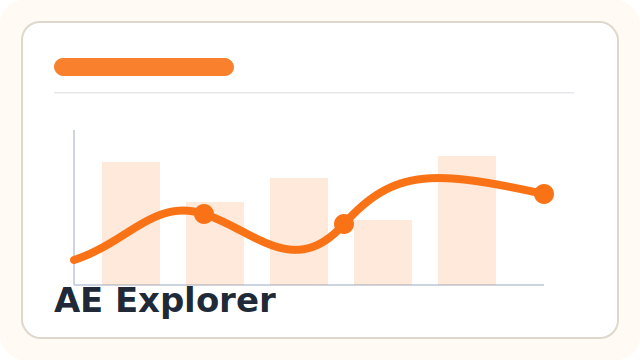
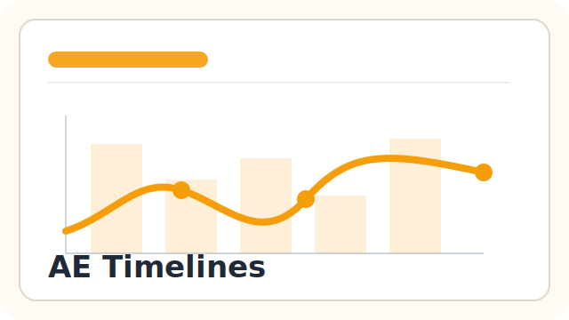
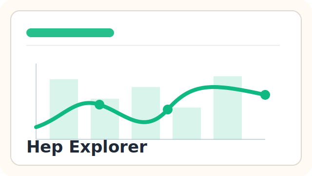
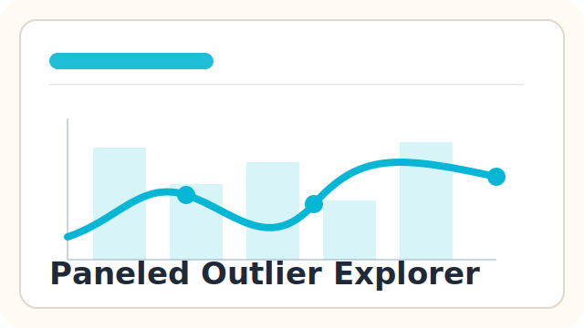
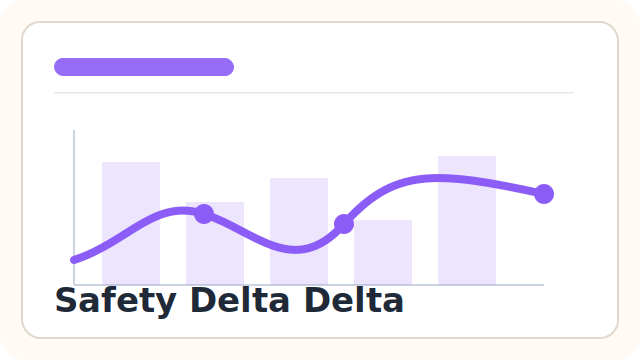
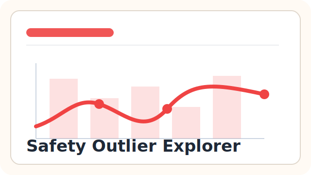
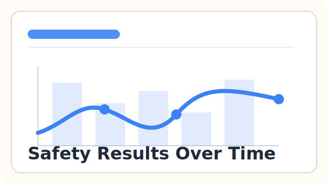
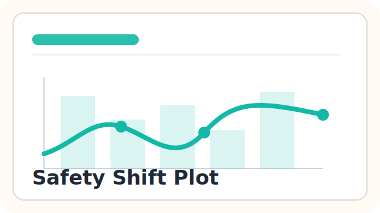

# gsm.safety

`gsm.safety` is an R package for generating clinical safety visualization artifacts from Good Statistical Monitoring workflows.

The first release, `v0.1.0`, focuses on workflow-driven SafetyCharts HTML widget reports. Reports are defined in YAML, run with `workr::RunWorkflow()`, and rendered with `gsm.safety::RenderSafetyChartsWidget()` using reproducible `gsm.datasim`-backed example data.

## Current status

This repository contains:

- [Integration design](design/integration-design.md)
- [AE Explorer gap analysis](design/ae-explorer-gap-analysis.md)
- `workr`-shaped report workflows under `inst/workflow/3_reports/`
- Interactive SafetyCharts HTML report artifacts rendered through `safetyCharts::render_widget()`
- Pkgdown examples that run the report YAML workflows with `workr::RunWorkflow()`
- GitHub Actions R CMD check, pkgdown, coverage, and workflow-template checks

The package intentionally avoids wrapping the full SafetyGraphics Shiny app. The current scope is standalone report artifacts that can be generated from GSM-style mapped data. Nep Explorer is excluded from `v0.1.0` because the legacy htmlwidget path is no longer supported; future NEP support should be considered through a Shiny-app pipeline or a static graphic.

## Available widget reports

The pkgdown home page uses a thumbnail gallery so reviewers can scan the available interactive reports and jump directly to each rendered example.

<div style="display:grid; grid-template-columns:repeat(auto-fit, minmax(220px, 1fr)); gap:1rem; margin:1rem 0 1.5rem 0;">
  <a href="https://obot-claw.github.io/gsm.safety/dev/menus/examples/Example_AE_Explorer_Workflow.html" style="display:block; border:1px solid #ddd; border-radius:10px; overflow:hidden; text-decoration:none; color:inherit; background:#fff;">
    
    <div style="padding:0.75rem;">
      <strong>AE Explorer</strong><br />
      <small><code>inst/workflow/3_reports/ae_explorer.yaml</code></small>
    </div>
  </a>
  <a href="https://obot-claw.github.io/gsm.safety/dev/menus/examples/Example_AE_Timelines_Workflow.html" style="display:block; border:1px solid #ddd; border-radius:10px; overflow:hidden; text-decoration:none; color:inherit; background:#fff;">
    
    <div style="padding:0.75rem;">
      <strong>AE Timelines</strong><br />
      <small><code>inst/workflow/3_reports/ae_timelines.yaml</code></small>
    </div>
  </a>
  <a href="https://obot-claw.github.io/gsm.safety/dev/menus/examples/Example_HepExplorer_Workflow.html" style="display:block; border:1px solid #ddd; border-radius:10px; overflow:hidden; text-decoration:none; color:inherit; background:#fff;">
    
    <div style="padding:0.75rem;">
      <strong>Hep Explorer</strong><br />
      <small><code>inst/workflow/3_reports/hep_explorer.yaml</code></small>
    </div>
  </a>
  <a href="https://obot-claw.github.io/gsm.safety/dev/menus/examples/Example_PaneledOutlierExplorer_Workflow.html" style="display:block; border:1px solid #ddd; border-radius:10px; overflow:hidden; text-decoration:none; color:inherit; background:#fff;">
    
    <div style="padding:0.75rem;">
      <strong>Paneled Outlier Explorer</strong><br />
      <small><code>inst/workflow/3_reports/paneled_outlier_explorer.yaml</code></small>
    </div>
  </a>
  <a href="https://obot-claw.github.io/gsm.safety/dev/menus/examples/Example_SafetyDeltaDelta_Workflow.html" style="display:block; border:1px solid #ddd; border-radius:10px; overflow:hidden; text-decoration:none; color:inherit; background:#fff;">
    
    <div style="padding:0.75rem;">
      <strong>Safety Delta Delta</strong><br />
      <small><code>inst/workflow/3_reports/safety_delta_delta.yaml</code></small>
    </div>
  </a>
  <a href="https://obot-claw.github.io/gsm.safety/dev/menus/examples/Example_SafetyHistogram_Workflow.html" style="display:block; border:1px solid #ddd; border-radius:10px; overflow:hidden; text-decoration:none; color:inherit; background:#fff;">
    
    <div style="padding:0.75rem;">
      <strong>Safety Histogram</strong><br />
      <small><code>inst/workflow/3_reports/safety_histogram.yaml</code></small>
    </div>
  </a>
  <a href="https://obot-claw.github.io/gsm.safety/dev/menus/examples/Example_SafetyOutlierExplorer_Workflow.html" style="display:block; border:1px solid #ddd; border-radius:10px; overflow:hidden; text-decoration:none; color:inherit; background:#fff;">
    
    <div style="padding:0.75rem;">
      <strong>Safety Outlier Explorer</strong><br />
      <small><code>inst/workflow/3_reports/safety_outlier_explorer.yaml</code></small>
    </div>
  </a>
  <a href="https://obot-claw.github.io/gsm.safety/dev/menus/examples/Example_SafetyResultsOverTime_Workflow.html" style="display:block; border:1px solid #ddd; border-radius:10px; overflow:hidden; text-decoration:none; color:inherit; background:#fff;">
    
    <div style="padding:0.75rem;">
      <strong>Safety Results Over Time</strong><br />
      <small><code>inst/workflow/3_reports/safety_results_over_time.yaml</code></small>
    </div>
  </a>
  <a href="https://obot-claw.github.io/gsm.safety/dev/menus/examples/Example_SafetyShiftPlot_Workflow.html" style="display:block; border:1px solid #ddd; border-radius:10px; overflow:hidden; text-decoration:none; color:inherit; background:#fff;">
    
    <div style="padding:0.75rem;">
      <strong>Safety Shift Plot</strong><br />
      <small><code>inst/workflow/3_reports/safety_shift_plot.yaml</code></small>
    </div>
  </a>
</div>

Thumbnail assets live in `man/figures/widgets/`. To regenerate browser-based screenshots for the gallery, install the Node development dependencies and run:

```sh
npm install
npm run capture:widget-thumbnails
```

The capture script uses Playwright so the JavaScript widgets can finish rendering before screenshots are taken.

## Workflow approach

The implemented workflows keep the report contract in YAML and use `MakeExampleData()` for reproducible examples:

1. `meta$domains` maps GSM workflow data names, currently `Mapped_SUBJ`, `Mapped_AE`, and `Mapped_LB`, to the domain shapes expected by each SafetyCharts widget.
2. `meta$widgetSettings` stores the widget column mapping used by `safetyCharts`, including `sex` as the current example grouping variable when supported.
3. Workflows call the relevant `safetyCharts::init_*()` helper when one exists; widgets without an init helper pass data/settings directly to the renderer.
4. `gsm.safety::RenderSafetyChartsWidget()` renders the widget with `safetyCharts::render_widget()` and writes a standalone HTML report.

The YAML is the authoritative configuration, and the generated HTML widget is the report artifact.

## Development

This project intentionally does **not** use `renv` yet. The dependency surface is still changing, and the first release should establish the core package/API boundaries before adding lockfile maintenance.

Run the AE Explorer workflow example with:

```r
source(system.file("examples", "run-ae-explorer-workflow.R", package = "gsm.safety"))
```

From a source checkout, use:

```r
source("inst/examples/run-ae-explorer-workflow.R")
```

The pkgdown examples use `workr::RunWorkflow()` against the workflow YAML files and render the returned htmlwidget output.

Run local checks with:

```r
rcmdcheck::rcmdcheck(args = "--no-manual")
```

or from a shell with R installed:

```sh
R CMD check --no-manual gsm.safety
```

## Next milestones

1. Merge PR #26 and cut the first `v0.1.0` release with the available SafetyCharts widget reports.
2. Harden the GSM-to-SafetyCharts mapping contract against real `gsm.mapping` outputs.
3. Decide the dependency strategy for remote SafetyCharts/Tendril dependencies versus vendoring or reimplementation.
4. Review FDA ST&F / Duke-Margolis materials and create issues for static safety displays.
5. Revisit NEP support as a Shiny app pipeline or static graphic rather than as a legacy htmlwidget.

## License

Apache License 2.0.
