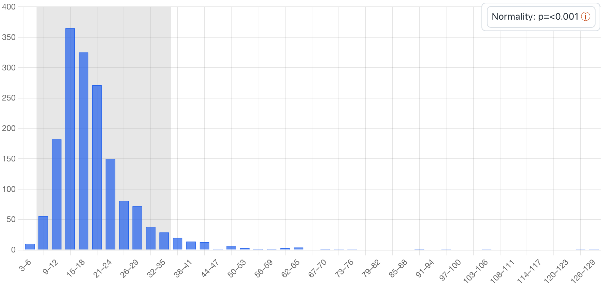
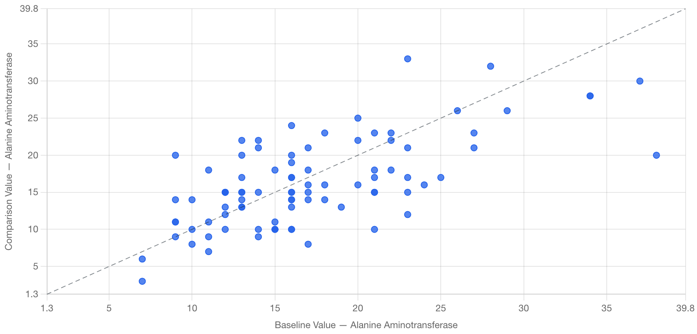
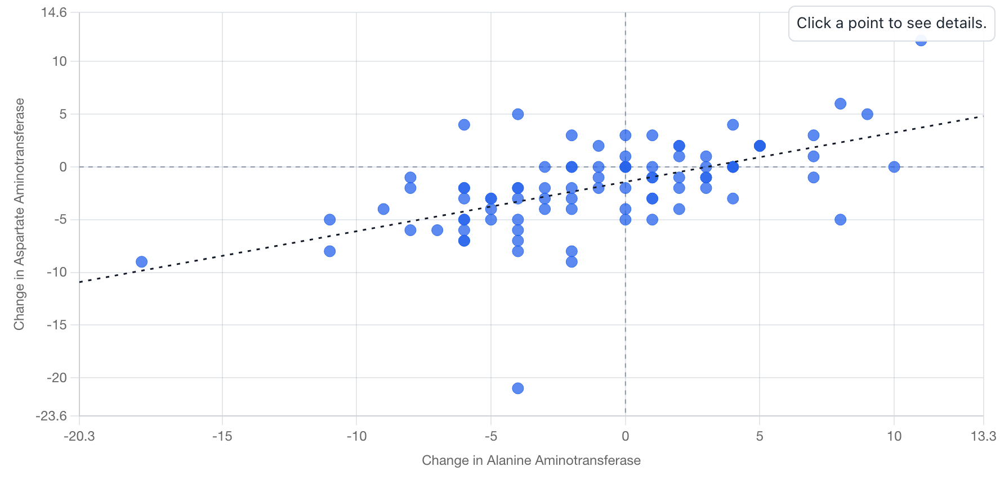
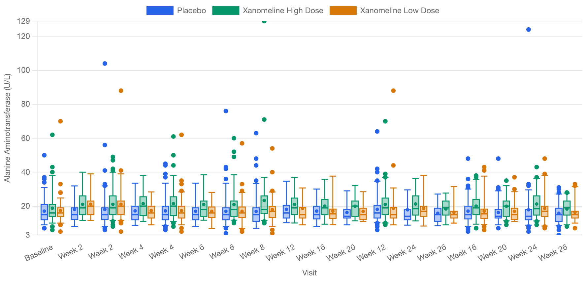
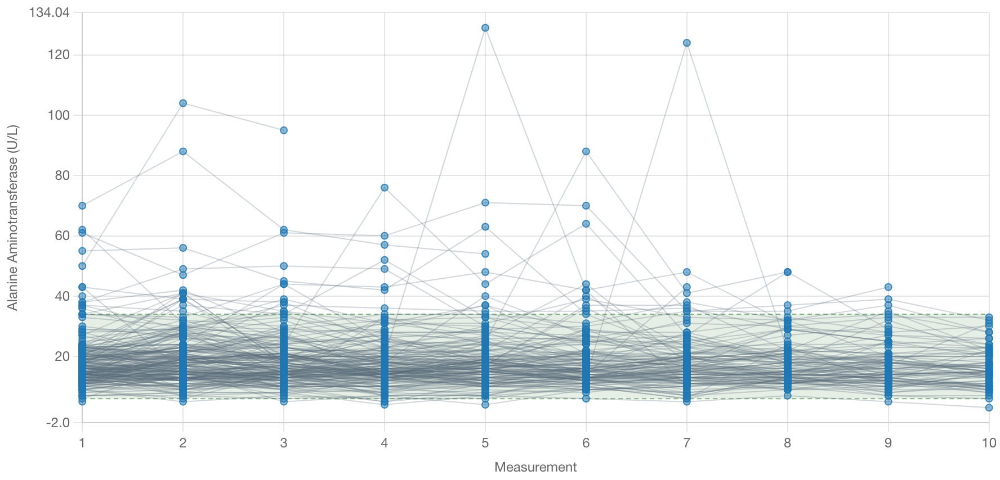
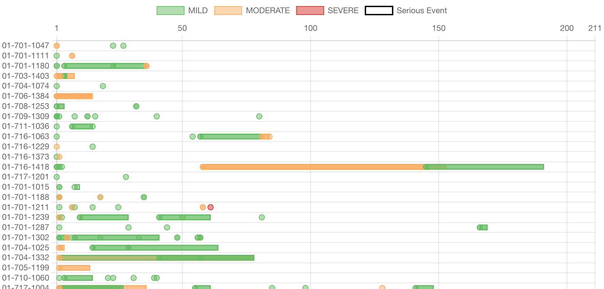
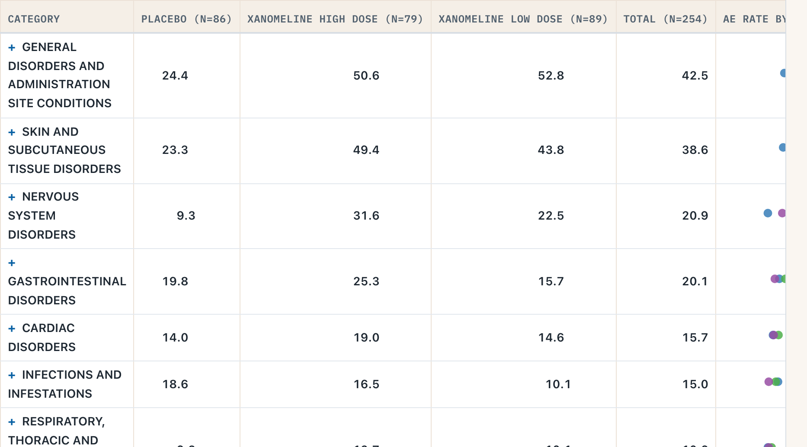
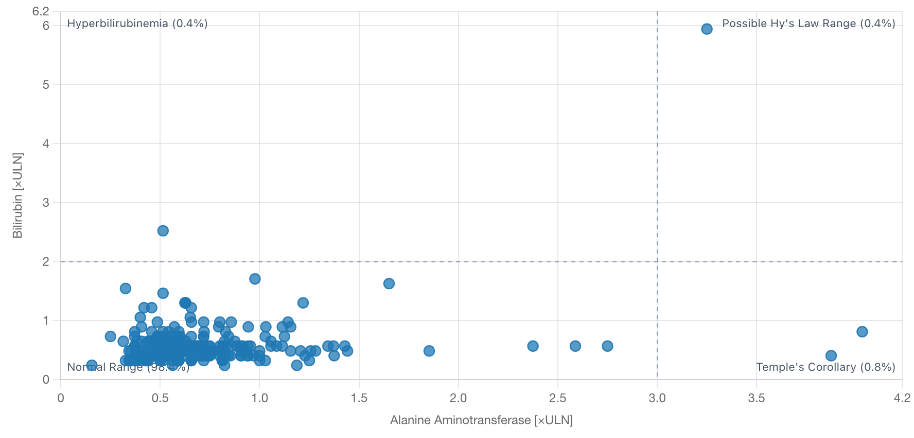
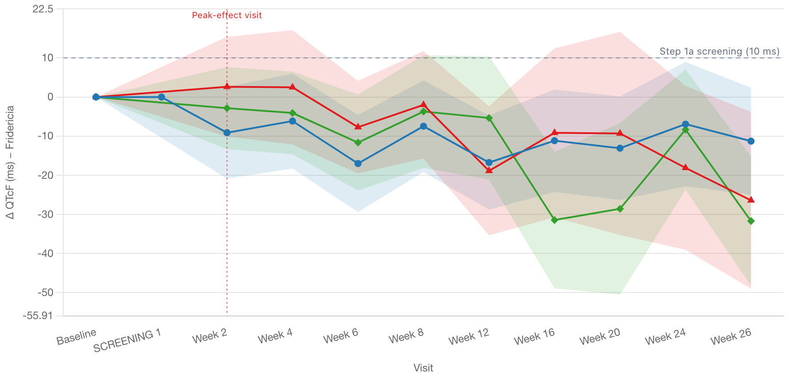

# gsm.safety

`gsm.safety` provides R bindings for the [safety.viz](https://github.com/jwildfire/safety.viz) JavaScript chart library: nine interactive clinical safety displays as htmlwidgets — one for every renderer the library ships — plus bundled example data and report workflows for Good Statistical Monitoring. It mirrors the `gsm.kri` / `gsm.viz` architecture.

## Gallery

Each thumbnail links to a live, interactive example rendered from the bundled demo data.

<table>
<tr>
<td width="33%" align="center">
  <a href="https://jwildfire.github.io/gsm.safety/examples/Example_Histogram.html"></a><br>
  <a href="https://jwildfire.github.io/gsm.safety/examples/Example_Histogram.html"><b>Histogram</b></a><br>
  <sub><code>Widget_Histogram()</code></sub>
</td>
<td width="33%" align="center">
  <a href="https://jwildfire.github.io/gsm.safety/examples/Example_ShiftPlot.html"></a><br>
  <a href="https://jwildfire.github.io/gsm.safety/examples/Example_ShiftPlot.html"><b>Shift Plot</b></a><br>
  <sub><code>Widget_ShiftPlot()</code></sub>
</td>
<td width="33%" align="center">
  <a href="https://jwildfire.github.io/gsm.safety/examples/Example_DeltaDelta.html"></a><br>
  <a href="https://jwildfire.github.io/gsm.safety/examples/Example_DeltaDelta.html"><b>Delta-Delta</b></a><br>
  <sub><code>Widget_DeltaDelta()</code></sub>
</td>
</tr>
<tr>
<td width="33%" align="center">
  <a href="https://jwildfire.github.io/gsm.safety/examples/Example_ResultsOverTime.html"></a><br>
  <a href="https://jwildfire.github.io/gsm.safety/examples/Example_ResultsOverTime.html"><b>Results Over Time</b></a><br>
  <sub><code>Widget_ResultsOverTime()</code></sub>
</td>
<td width="33%" align="center">
  <a href="https://jwildfire.github.io/gsm.safety/examples/Example_OutlierExplorer.html"></a><br>
  <a href="https://jwildfire.github.io/gsm.safety/examples/Example_OutlierExplorer.html"><b>Outlier Explorer</b></a><br>
  <sub><code>Widget_OutlierExplorer()</code></sub>
</td>
<td width="33%" align="center">
  <a href="https://jwildfire.github.io/gsm.safety/examples/Example_AeTimelines.html"></a><br>
  <a href="https://jwildfire.github.io/gsm.safety/examples/Example_AeTimelines.html"><b>AE Timelines</b></a><br>
  <sub><code>Widget_AeTimelines()</code></sub>
</td>
</tr>
<tr>
<td width="33%" align="center">
  <a href="https://jwildfire.github.io/gsm.safety/examples/Example_AeExplorer.html"></a><br>
  <a href="https://jwildfire.github.io/gsm.safety/examples/Example_AeExplorer.html"><b>AE Explorer</b></a><br>
  <sub><code>Widget_AeExplorer()</code></sub>
</td>
<td width="33%" align="center">
  <a href="https://jwildfire.github.io/gsm.safety/examples/Example_HepExplorer.html"></a><br>
  <a href="https://jwildfire.github.io/gsm.safety/examples/Example_HepExplorer.html"><b>Hepatic Safety Explorer</b></a><br>
  <sub><code>Widget_HepExplorer()</code></sub>
</td>
<td width="33%" align="center">
  <a href="https://jwildfire.github.io/gsm.safety/examples/Example_QtExplorer.html"></a><br>
  <a href="https://jwildfire.github.io/gsm.safety/examples/Example_QtExplorer.html"><b>QT Safety Explorer</b></a><br>
  <sub><code>Widget_QtExplorer()</code></sub>
</td>
</tr>
</table>

## Widgets

| Widget | safety.viz module | Data | Report workflow |
|---|---|---|---|
| `Widget_Histogram()` | histogram | `adbds` | [`safety_histogram.yaml`](inst/workflow/3_reports/safety_histogram.yaml) |
| `Widget_ShiftPlot()` | shiftPlot | `adbds` | [`safety_shift_plot.yaml`](inst/workflow/3_reports/safety_shift_plot.yaml) |
| `Widget_DeltaDelta()` | deltaDelta | `adbds` | [`safety_delta_delta.yaml`](inst/workflow/3_reports/safety_delta_delta.yaml) |
| `Widget_ResultsOverTime()` | resultsOverTime | `adbds` | [`safety_results_over_time.yaml`](inst/workflow/3_reports/safety_results_over_time.yaml) |
| `Widget_OutlierExplorer()` | outlierExplorer | `adbds` | [`safety_outlier_explorer.yaml`](inst/workflow/3_reports/safety_outlier_explorer.yaml) |
| `Widget_AeTimelines()` | aeTimelines | `adae` | [`ae_timelines.yaml`](inst/workflow/3_reports/ae_timelines.yaml) |
| `Widget_AeExplorer()` | aeExplorer | `adae` | [`ae_explorer.yaml`](inst/workflow/3_reports/ae_explorer.yaml) |
| `Widget_HepExplorer()` | hepExplorer | `adbds` | [`hep_explorer.yaml`](inst/workflow/3_reports/hep_explorer.yaml) |
| `Widget_QtExplorer()` | qtExplorer | `adeg` | [`qt_explorer.yaml`](inst/workflow/3_reports/qt_explorer.yaml) |

Each widget validates its data and settings against the module's vendored JSON data contract (`inst/schema/`) before rendering, so column-mapping mistakes fail fast in R.

## Usage

```r
library(gsm.safety)

# Bundled pharmaverseadam-derived demo data (same data as the safety.viz site demos)
dfResults <- ExampleData("adbds") # long-format labs and vitals
dfAE <- ExampleData("adae") # adverse events
dfEG <- ExampleData("adeg") # ECG: QTcF, QTcB, heart rate

# Render a widget in the viewer
Widget_Histogram(dfResults, lSettings = list(group_by = "ARM"))

# Or save any widget as a self-contained HTML report
SaveWidgetReport(
  Widget_Histogram(dfResults),
  strOutputDir = tempdir(),
  strOutputFile = "histogram"
)
```

Settings are merged onto each module's defaults client-side, so only overrides are needed; the defaults already match the example data column names.

## Report workflows

Report workflows under `inst/workflow/3_reports/` render each widget end-to-end via `gsm.core::RunWorkflow()`. Matching runner scripts live in `inst/examples/`:

```sh
Rscript inst/examples/histogram.R [output_dir]
```

## Development

```r
devtools::test()
devtools::check()
```

The gallery thumbnails in `man/figures/widgets/` are vendored byte-identical from the safety.viz release assets — the canonical headless-Chromium captures that repo publishes for its own gallery. Refresh them whenever the vendored bundle is bumped:

```sh
tools/vendor-widget-thumbnails.sh [path-to-safety.viz-checkout]
```

## License

Apache License 2.0.
